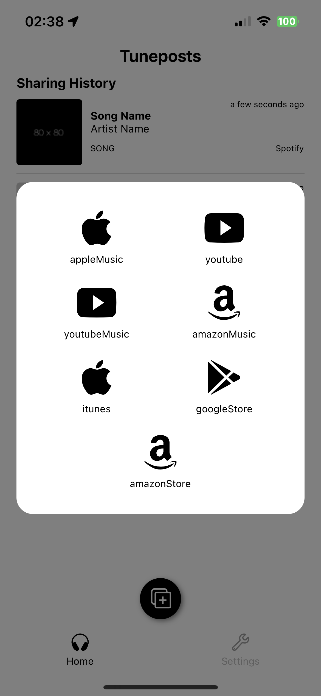

## Introduction

If you haven't heard about ChatGPT yet, it's a state-of-the-art AI language 
model developed by OpenAI, based on the GPT-4 architecture. 
It has been making waves in the tech world lately for its impressive 
capabilities in understanding and generating human-like text. 
It can assist with a wide range of tasks, such as answering questions, 
writing emails, generating content, and even helping with code!

After about a week of playing with this powerful language model, I figured 
I should see how it can help with projects I've been working on. 
For this blog series, I'll be discussing my experience building a 
music sharing app that enables users to share links from one streaming service 
to another in a seamless way. The app aims to make sharing music links 
between different platforms as close to a one-tap experience as possible.

_All of the code provided was simplified for context_

### Introducing MusicShare, the Music Sharing App

Are you tired of the hassle of sharing music links between different 
streaming platforms? As music lovers, we know the frustration of wanting to 
share a song with a friend, only to find out that they're using a different 
music service than you. That's why I've been working on an iOS app that makes 
sharing music links easier than ever.

The app simplifies the process of converting music streaming links to links 
compatible with other popular services including Spotify, Apple Music, YouTube, 
Tidal, and more - all with just a few taps. The coolest and primary feature: 
the app will integrate seamlessly with your existing music apps! 
No need to launch the entire app - just select our app from the share prompt 
and our selection menu will appear.

Under the hood, we're using React Native and custom native code written in 
Swift to leverage the iOS share extension in our app. Sorry Android users, 
maybe I'll make a custom Kotlin module in the future.

Development is still in progress for the app, but throughout the process, 
ChatGPT has proven to be a truly unique and powerful tool, providing assistance 
in catching errors, suggesting improvements, and even building simple 
components.

## Collaborating with ChatGPT: From Error Detection to Component Creation

### Priming ChatGPT with the context of the project

My objective was to give ChatGPT only what it needed to be able to provide me 
with useful responses:

- a description and goal of the project
- a custom React hook `useSongLink.js`
- the main screen `Home.js`

### Catching errors and suggesting improvements with ChatGPT

With those inputs, ChatGPT quickly caught an oversight with how I set
and reset the `loading` flag in my hook:
> Also, it's better to handle the loading state properly by
updating it after the API call is completed.
Here's an updated version of your hook:

```javascript
// ...useSongLink hook
const fetchLink = async () => {
    setLoading(true);
    try {
      const response = await fetch(apiUrl, {
        redirect: 'follow',
      });
      if (response.ok) {
        setNewLink(response.url);
      }
    } catch (err) {
      setError(err);
      console.log('[useSongLink error]', err);
    } finally {
      setLoading(false);
    }
  };
  // ...Rest of the hook code
```

ChatGPT reminded me of the `finally` statement that comes with a `try-catch`, 
and helped me move my `setLoading(false)` method from being called _after_ 
`fetchLinks()`.

Another instance where ChatGPT proved helpful was in optimizing the hook. 
Initially, the hook would run as soon as the app launched, causing unnecessary 
fetches. ChatGPT suggested implementing a `requestFetch` method in the hook to 
prevent this from happening.


```javascript
// Before
useEffect(() => {
  if (!url) return;
  fetchLink();
}, [url]);

return {
  data: newLink,
  loading,
  error,
};


// After
const [fetchRequested, setFetchRequested] = useState(false);

useEffect(() => {
  if (!fetchRequested || !url) return;
  fetchLinks();
}, [url, fetchRequested]);

const requestFetch = () => {
  setFetchRequested(true);
};

return {
  data: newLink,
  loading,
  error,
  requestFetch, // where have I seen this before?
};
```

Apollo GraphQL uses something similar to this idea, with `refetch`. I hadn't 
thought about ways of using the concept, but ChatGPT spelled it out for me, 
literally, and helped me learn of a new technique painlessly!

### Building a Modal component from scratch


Before ChatGPT, my home screen had a placeholder list (it's still a placeholder)
 and a button that would run the API and log the new URL to the console. 
The platform was fixed to Youtube, since I was using Spotify as the initial 
links. I figured that this was a good moment to see how it would handle a
task to create something new, so I asked it to build a modal with the available 
platforms so that the user can select what platform to conver the link to. 
ChatGPT quickly got to work, creating icon names using Ionicon's convention, 
and building out a transparent modal with a scrollview that was glued to the 
left side of the screen. I was unhappy with the result, so I gave it a kick in 
the butt:
> Me: Can you display the available platforms modal as a centered grid optimized 
for user experience instead of a ScrollView?

> GPT: Certainly!

```jsx
// other imports and definitions
// note: GPT **did** give me correct imports
const Home = () => {
  // ... (other state variables and functions)

  const renderPlatform = (platform) => (
    <TouchableOpacity key={platform} style={styles.platformContainer} onPress={() => handlePlatformSelect(platform)}>
      <Icon name={platformIcons[platform]} size={48} style={styles.platformIcon} />
      <Text style={styles.platformText}>{platform}</Text>
    </TouchableOpacity>
  );

  return (
    <View style={styles.container}>
      <Modal
        animationType="slide"
        transparent
        visible={modalVisible}
        onRequestClose={() => { setModalVisible(false); }}
      >
        <View style={styles.modalBackground}>
          <View style={styles.modalContent}>
            {PLATFORMS.map(renderPlatform)}
          </View>
        </View>
      </Modal>
      // ... (other components and elements)
    </View>
  );
};

```

It worked! To add icing to the cake, GPT even named it's own styles and 
provided the CSS for them:

```javascript
// ... (other styles)

modalBackground: {
  flex: 1,
  justifyContent: 'center',
  alignItems: 'center',
  backgroundColor: 'rgba(0, 0, 0, 0.5)',
},

modalContent: {
  flexWrap: 'wrap',
  flexDirection: 'row',
  justifyContent: 'center',
  backgroundColor: 'white',
  borderRadius: 10,
  padding: 20,
  width: '80%',
},

platformContainer: {
  width: '50%',
  alignItems: 'center',
  justifyContent: 'center',
  padding: 10,
},

platformIcon: {
  marginBottom: 5,
},

platformText: {
  fontSize: 14,
  textAlign: 'center',
},

// ... (other styles)
```

I cleaned up the styles by replacing the `width` fields with `margin` and 
removing the percentages. The result:


Obviously this isn't the final product, but for a quick build and test, this 
was pretty painless! GPT-4 even added a little alert to let the user know that 
the new URL was copied to their clipboard:


ChatGPT completed the result by giving me additional code to implement a new 
parameter `selectedPlatform` to the `useSongLink` hook, effectively adding 
new functionality to my project from a series of prompts.

The `useSongLink` hook now generates the appropriate music platform 
link _dynamically_ based on the user's selection in the Home component's Modal. 
This seamless integration between the Home component and the useSongLink hook 
showcases ChatGPT's ability to work with existing code 
and provide meaningful enhancements.

## Conclusion

Throughout the enhancement of this music sharing project (still in progress), 
ChatGPT has proven to be a killer developer's tool, assisting in 
error detection, code optimization, and component creation. 

I don't think GPT-4 is ready to take a developer's job just yet, but it is 
definitely a resource that all developer's should learn to master in order 
to be more efficient and effective, and learn best--or new--practices.

I look forward to sharing more about my journey working on this project 
and the role ChatGPT plays in refining and enhancing my work.

The latest trends and buzzworthy ideas aren't always 
the best indicators of a project's potential impact. 
That's why this app focuses on making sharing music links easier and 
more accessible for all music lovers, regardless of the platform they use. 
So if you're tired of the hassle of switching between different music services 
just to share a song, I hope you give my app a try when it's released. If 
you're interested in trying out the beta version of the app, feel free to reach 
out and I will let you know when it's available.

**PS:** _MusicShare_ is the placeholder name of the project, 
but ChatGPT has already given me great ideas, 
let me know which one you like best:

- SoundBridge
- TuneSwitch
- MelodyMerge
- HarmonyLink
- RhythmRoute
- SongSyncer
- TrackTraverse
- BeatBridge
- AudioAtlas
- MelodyMingle
